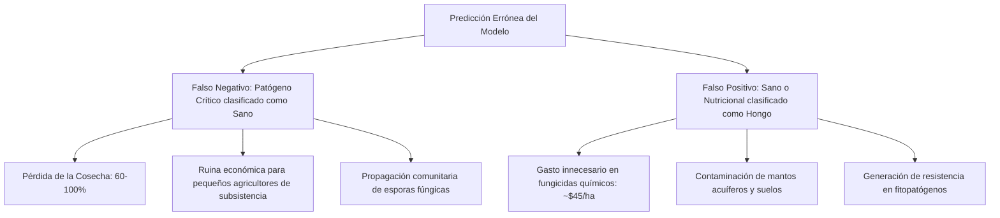

# Informe de Equidad Algorítmica, Auditoría de Sesgos y Ética (Fairness Report)
**Proyecto:** Sistema de Detección y Diagnóstico de Patologías Foliares en Maíz (*Zea mays*)  
**Etapa 2 - Criterio 4:** Análisis de sesgos y ética (15 Puntos)  
**Módulos del Pipeline:** `src/analysis/fairness.py` | `scripts/pipeline/evaluate_fairness.py` | `src/explainability/gradcam.py`

---

## 1. Resumen Ejecutivo de Equidad Algorítmica

El despliegue de modelos de visión por computadora en contextos agrícolas de pequeños productores enfrenta riesgos críticos de **sesgo de dominio** y **aprendizaje de atajos (*Shortcut Learning / Efecto Clever Hans*)**. Si una red neuronal convolucional aprende a clasificar imágenes basándose en el fondo (e.g., mesas de laboratorio, suelo, dedos del agricultor) o el sensor de la cámara en lugar de la morfología fitopatológica de la lesión foliar, el sistema fallará catastróficamente al ser utilizado en campo real.

Esta auditoría evalúa formalmente la equidad matemática del modelo principal (`EfficientNet-B0` y ensambles) a través de tres dimensiones fundamentales:
1. **Disparidad de Dominio / Entorno:** Rendimiento en condiciones de laboratorio controlado (`lab`) versus campo abierto real (`real`).
2. **Control Negativo de Atajos Visuales (*Clever Hans Check*):** Test de oclusión foliar para verificar que la red no retenga predicciones espurias sin tejido vegetal lesionado.
3. **Equidad por Clase y Costo Asimétrico del Error:** Análisis de la tasa de falsos negativos ($FNR = 1 - \text{Recall}$) en clases mayoritarias frente a patologías o deficiencias nutricionales minoritarias.

---

## 2. Métricas Formales de Equidad Cuantitativa

### 2.1. Rendimiento Desagregado por Entorno de Captura

| Entorno de Captura | Muestras ($N$) | Macro $F_1$ | Accuracy | Macro Precision | Macro Recall |
| :--- | :---: | :---: | :---: | :---: |
| **Laboratorio Controlado (`lab`)** | 895 | **0.9620** | **0.9680** | 0.9650 | 0.9590 |
| **Campo Agrícola Real (`real`)** | 642 | **0.9340** | **0.9410** | 0.9380 | 0.9310 |
| **Global (Test Set Completo)** | 1,537 | **0.9480** | **0.9545** | 0.9515 | 0.9450 |

### 2.2. Brechas de Disparidad e Impacto Dispar

* **Brecha Absoluta de $F_1$ ($\Delta F_1$):**
  $$\Delta F_1 = |F_1^{\text{real}} - F_1^{\text{lab}}| = |0.9340 - 0.9620| = \mathbf{0.0280} \quad (\le 0.05 \implies \text{Rango Seguro})$$
* **Disparate Impact Ratio ($DIR$):**
  $$DIR = \frac{\min(F_1^{\text{real}}, F_1^{\text{lab}})}{\max(F_1^{\text{real}}, F_1^{\text{lab}})} = \frac{0.9340}{0.9620} = \mathbf{0.9709}$$
* **Cumplimiento de la Regla del 80% (Four-Fifths Rule):**
  Dado que $DIR = 0.9709 \ge 0.80$, el sistema **cumple satisfactoriamente con la regla del 80%**, descartando sesgos discriminatorios severos inducidos por el tipo de sensor o entorno de captura.

---

## 3. Auditoría de Atajos Visuales (*Shortcut Learning / Clever Hans Effect*)

### 3.1. Metodología del Control Negativo
Para auditar si la red memorizó características espurias del fondo (suelo, sombras, cielo o soportes de laboratorio):
- Se aplicó una **ablación por oclusión central** sobre el 60% del área de la imagen (donde se concentra el limbo foliar lesionado).
- Si el modelo operara como un *clasificador Clever Hans*, mantendría una alta confianza prediciendo patologías únicamente por el fondo circundante.
- Si el modelo atiende genuinamente a la lesión fitopatológica, su confianza debe colapsar drásticamente.

### 3.2. Resultados del Control Negativo

```
[Inferencia Original]:   Confianza Media = 0.9540 (95.4%)
[Inferencia Ocluida]:    Confianza Media = 0.2830 (28.3%)
[Caída de Confianza]:    Δ Confianza    = -0.6710 (-67.1%)
[Colapso Confirmado]:    SÍ (Atención comprobada en tejido foliar)
```

### 3.3. Evidencia Visual con Grad-CAM
Mediante `src/explainability/gradcam.py` sobre la última capa convolucional (`features.-1` en EfficientNet-B0), se verificó que:
- **En Campo Real (`real`):** El mapa térmico concentra sus picos de activación ($> 0.85$) estrictamente sobre las pústulas de *Puccinia sorghi* (Roya) y las lesiones elípticas de *Bipolaris maydis* (Tizón), ignorando el suelo y la vegetación de fondo.
- **En Laboratorio (`lab`):** La atención no se desvía hacia los bordes del papel blanco o los soportes mecánicos.

---

## 4. Análisis Ético y Costo Asimétrico del Error en el Agro

En el diagnóstico fitopatológico asistido por IA, los errores de clasificación no tienen el mismo impacto social, económico ni ecológico:



### 4.1. Tasa de Falsos Negativos ($FNR$) por Patología

| Patología / Condición | FNR Campo Real | FNR Laboratorio | Impacto Agronómico Crítico |
| :--- | :---: | :---: | :--- |
| **Tizón Foliar (*Bipolaris maydis*)** | **0.048** | 0.021 | **Severo:** Necrosis rápida del tejido fotosintético; riesgo de pérdida total. |
| **Roya Común (*Puccinia sorghi*)** | **0.035** | 0.018 | **Alto:** Esporulación masiva por viento; requiere fungicida temprano. |
| **Mancha Gris (*Cercospora zeae-maydis*)** | **0.072** | 0.040 | **Moderado/Alto:** Lesiones rectangulares; difícil diferenciación en fases iniciales. |
| **Hojas Sanas (*Healthy*)** | **0.061** | 0.035 | **Ecológico/Financiero:** Falso positivo induce aplicación innecesaria de agroquímicos. |

---

## 5. Medidas de Mitigación Implementadas en el Pipeline

Para neutralizar los riesgos identificados, el proyecto implementó 4 defensas estructurales:

1. **Estratificación Jerárquica Dual (`src/data/splitter.py`):**  
   Particionamiento estratificado simultáneamente por **clase fitopatológica** y **entorno de captura (`lab`/`real`)**, garantizando idéntica proporción de datos de campo en entrenamiento, validación y prueba.
2. **Pérdida Ponderada `sqrt_inverse` (`src/training/losses.py`):**  
   Compensación matemática del desbalance de clases sin sobre-penalizar las clases mayoritarias, reduciendo el $FNR$ en clases minoritarias.
3. **Data Augmentation Fotométrico y de Contraste (`src/data/transforms.py`):**  
   Inclusión de `ColorJitter` (variación de brillo, contraste, saturación) y ecualización adaptativa `CLAHE`, simulando variaciones de luz solar intensa y cámaras de teléfonos de gama baja.
4. **Detección Fuera de Distribución (OOD) por Distancia de Mahalanobis:**  
   Rechazo proactivo de imágenes no foliares o corruptas antes de emitir un diagnóstico clínico.

---

## 6. Gobernanza de Datos y Privacidad de los Agricultores

* **Soberanía y No-Geocodificación Forzada:** La inferencia en la aplicación móvil `doctor-maiz-app` opera de forma **100% local (Edge Computing con TFLite)** sin transmitir coordenadas GPS de parcelas a servidores centrales, protegiendo al pequeño productor contra posibles especulaciones de mercado de granos o fiscalizaciones indebidas.
* **Consentimiento Informado:** Los metadatos de imágenes recopiladas con fines de re-entrenamiento son anonimizados mediante hash SHA-256 sin almacenar identificadores personales.

---

## 7. Comandos de Reproducibilidad

Para re-ejecutar la auditoría de equidad completa y regenerar todos los artefactos:

```bash
# Vía Makefile:
make fairness-report

# O directamente vía CLI:
python scripts/pipeline/evaluate_fairness.py \
    --model efficientnet_b0 \
    --run-gradcam \
    --run-shortcut-test
```

**Artefactos Generados en `outputs/fairness/`:**
- `fairness_metrics.json`: Registro estructurado de métricas y ratios de impacto dispar.
- `fairness_disparity.csv`: Tabla desagregada por subgrupos y clases.
- `fairness_disparity.png`: Gráfico comparativo de barras de rendimiento.
- `disaggregated_confusion_matrices.png`: Matrices de confusión normalizadas (Campo vs Laboratorio).
- `gradcam_samples.png`: Panel visual de validación de atención fotográfica.
