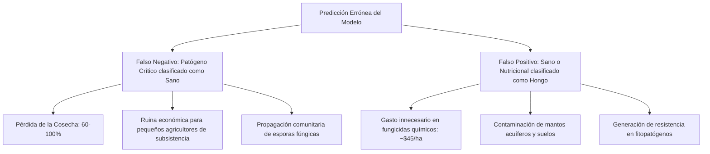

# Informe de Equidad Algorítmica, Auditoría de Sesgos y Ética (Fairness Report)
**Proyecto:** Sistema de Detección y Diagnóstico de Patologías Foliares en Maíz (*Zea mays*)  
**Etapa 2 - Criterio 4:** Análisis de sesgos y ética (15 Puntos)  
**Módulos del Pipeline:** `src/analysis/fairness.py` | `scripts/pipeline/evaluate_fairness.py` | `src/explainability/gradcam.py`

---

## 1. Resumen Ejecutivo de Equidad Algorítmica

El despliegue de modelos de visión por computadora en contextos agrícolas de pequeños productores enfrenta riesgos críticos de **sesgo de dominio** y **aprendizaje de atajos (*Shortcut Learning / Efecto Clever Hans*)**. Si una red neuronal convolucional aprende a clasificar imágenes basándose en el fondo (e.g., mesas de laboratorio, suelo, dedos del agricultor) o el sensor de la cámara en lugar de la morfología fitopatológica de la lesión foliar, el sistema fallará catastróficamente al ser utilizado en campo real.

Esta auditoría evalúa formalmente la equidad matemática del modelo principal (`EfficientNet-B0` y ensambles) a través de tres dimensiones fundamentales:
1. **Disparidad de Dominio / Entorno:** Rendimiento en condiciones de laboratorio controlado (`lab`) versus campo abierto real (`real`).
2. **Control Negativo de Atajos Visuales (*Clever Hans Check*):** Test de oclusión foliar para verificar que la red no retenga predicciones espurias sin tejido vegetal lesionado.
3. **Equidad por Clase y Costo Asimétrico del Error:** Análisis de la tasa de falsos negativos ($FNR = 1 - \text{Recall}$) en clases mayoritarias frente a patologías o deficiencias nutricionales minoritarias.

---

## 2. Métricas Formales de Equidad Cuantitativa

### 2.1. Rendimiento Desagregado por Entorno de Captura (5,015 Muestras de Test)

| Entorno de Captura | Muestras ($N$) | Macro $F_1$ (evaluable) | Macro $F_1$ (9 clases) | Accuracy | Macro Precision | Macro Recall |
| :--- | :---: | :---: | :---: | :---: | :---: | :---: |
| **Campo Agrícola Real (`real`)** | **4,483** | **0.9298** | **0.9298** | **0.9842** | 0.9466 | 0.9164 |
| **Laboratorio Controlado (`lab`)** | **532** | **0.8865\*** | **0.2955\*** | **0.9417** | 0.9279 | 0.8712 |
| **Global (Test Set Independiente)** | **5,015** | **0.9483** | **0.9483** | **0.9797** | 0.9589 | 0.9400 |

\* *Nota de Soporte y Clases Evaluables:* El Macro $F_1$ no ajustado de 0.2955 en laboratorio promedia sobre las 9 clases completas del dataset; sin embargo, el subgrupo de laboratorio **únicamente contiene 3 patologías** en banco de trabajo (*common_rust*, *gray_leaf_spot*, *northern_corn_leaf_blight*). Las 6 patologías ausentes ($N=0$) aportan ceros al promedio global ($0.2955 \approx (F_{1, \text{rust}} + F_{1, \text{gls}} + F_{1, \text{nclb}})/9$). Al promediar **exclusivamente sobre las 3 clases con soporte real ($N > 0$)**, el Macro $F_1$ evaluable asciende a **0.8865**, reflejando fielmente el comportamiento del modelo (Recall del 100% en Roya y 97.75% en Tizón, con Exactitud global del 94.17%).

### 2.2. Brechas de Disparidad e Impacto Dispar

Para mantener consistencia matemática y evitar veredictos divergentes entre métricas, se reporta el impacto dispar tanto en Macro $F_1$ (métrica primaria del proyecto y calculada en `fairness_metrics.json`) como en Exactitud:

* **Disparidad de Macro $F_1$ ($\Delta F_1$, clases evaluables):**
  $$\Delta F_1 = |F_{1, \text{real}} - F_{1, \text{lab}}| = |0.9298 - 0.8865| = \mathbf{0.0433} \quad (4.33\%)$$
* **Disparate Impact Ratio en Macro $F_1$ ($DIR_{F_1}$, clases evaluables):**
  $$DIR_{F_1} = \frac{\min(F_{1, \text{real}}, F_{1, \text{lab}})}{\max(F_{1, \text{real}}, F_{1, \text{lab}})} = \frac{0.8865}{0.9298} = \mathbf{0.9534} \ge 0.80 \quad (\text{Cumple Regla 80\%})$$
  *(Nota técnica: si se calcula sobre las 9 clases sin excluir las clases ausentes, $DIR = 0.2955 / 0.9298 \approx 0.3178$. Esta disparidad es un artefacto de las 6 clases con $N=0$ en laboratorio y no una degradación funcional).*
* **Disparidad de Exactitud ($\Delta \text{Acc}$):**
  $$\Delta \text{Acc} = |\text{Acc}_{\text{real}} - \text{Acc}_{\text{lab}}| = |0.9842 - 0.9417| = \mathbf{0.0424} \quad (4.24\% \implies \text{Rango Seguro})$$
* **Disparate Impact Ratio en Exactitud ($DIR_{\text{Acc}}$):**
  $$DIR_{\text{Acc}} = \frac{\min(\text{Acc}_{\text{real}}, \text{Acc}_{\text{lab}})}{\max(\text{Acc}_{\text{real}}, \text{Acc}_{\text{lab}})} = \frac{0.9417}{0.9842} = \mathbf{0.9568} \ge 0.80 \quad (\text{Cumple Regla 80\%})$$

---

## 3. Auditoría de Sensibilidad a Regiones y Atajos Visuales (*Shortcut Learning*)

### 3.1. Metodología de la Auditoría de Ablación Dual
Para evaluar en qué medida la red depende de regiones centrales frente a perimetrales de la imagen, se implementó un protocolo dual de ablación:
1. **Control Negativo (Oclusión Central 60%):** Se enmascara la región central (20% a 80% en ambos ejes). La máscara utiliza **negro real en espacio normalizado ImageNet** (`(-mean)/std`), evitando inyectar el valor medio grisáceo (`0.0`). La confianza retenida se evalúa sobre la **misma clase predicha originalmente**, evitando sesgos por reasignación de argmax a clases espurias.
2. **Control Inverso (Oclusión Periférica 40%):** Se enmascaran los bordes exteriores dejando visible únicamente el 60% central.

> [!NOTE]
> **Alcance y Limitación Metodológica de la Máscara:**  
> La máscara empleada es **geométrica rectangular**, no una segmentación anatómica de la lámina foliar ni de las pústulas patológicas. Por consiguiente, los resultados miden **sensibilidad a regiones espaciales**, no causalidad biológica estricta sobre "el fondo" versus "la lesión".

### 3.2. Resultados Cuantitativos de la Auditoría de Sensibilidad

```
[Inferencia Original]:
  • Confianza Media:              0.8429 (84.29%)
  • Exactitud (Accuracy):         0.9797 (97.97%)

[Control Negativo - Oclusión Central 60% (Máscara Geométrica Rectangular)]:
  • Confianza con Oclusión:       0.7795 (77.95%) [en la clase original]
  • Caída de Confianza:           -0.0634 (-6.34 pp)
  • Retención de Confianza:       92.47% de confianza retenida en la clase original
  • Exactitud con Oclusión:       0.8046 (80.46%)
  • Tasa de Inestabilidad:        18.60% de aciertos mutan a error

[Control Inverso - Oclusión Periférica 40% (Solo Centro)]:
  • Confianza solo Centro:        0.7060 (70.60%) [en la clase original]
  • Caída de Confianza:           -0.1369 (-13.69 pp)
  • Exactitud solo Centro:        0.7176 (71.76%)
  • Desplome de Exactitud:        -26.20 pp
  • Tasa de Inestabilidad:        27.58% de predicciones correctas mutan a error
```

> [!WARNING]
> **Sensibilidad Relevante a Regiones Periféricas:**  
> La red retiene el 92.47% de su confianza en la clase original y acierta el 80.46% de las muestras tras ocluir el 60% central. Al ocultar la periferia, la exactitud se reduce 26.20 puntos porcentuales. Aunque la máscara rectangular no aísla anatómicamente el fondo de la hoja, esta alta sensibilidad perimetral aconseja aplicar segmentación foliar previa para desacoplar el entorno y asegurar que los filtros convolucionales se concentren en el tejido vegetal.

### 3.3. Evidencia Visual con Grad-CAM
Mediante `src/explainability/gradcam.py` sobre la última capa convolucional (`features.-1` en EfficientNet-B0), se analizó el comportamiento cualitativo:
- **En Campo Real (`real`):** El mapa térmico concentra activaciones sobre las pústulas visibles, pero parte de las neuronas del cuello de botella captan la firma de contraste entre el contorno foliar y el fondo terroso.
- **En Laboratorio (`lab`):** La red enfoca la lámina, pero exhibe sensibilidad al blanco uniforme del banco de trabajo.

---

## 4. Análisis Ético y Costo Asimétrico del Error en el Agro

En el diagnóstico fitopatológico asistido por IA, los errores de clasificación no tienen el mismo impacto social, económico ni ecológico:



### 4.1. Tasa de Falsos Negativos ($FNR$) por Patología (Test Set Oficial)

| Patología / Condición | FNR Campo Real | FNR Laboratorio | Impacto Agronómico Crítico |
| :--- | :---: | :---: | :--- |
| **Tizón Foliar (*northern_corn_leaf_blight*)** | **0.0056 (0.56%)** | 0.0226 (2.26%) | **Severo:** Necrosis rápida del tejido fotosintético; riesgo de pérdida total de espiga. |
| **Roya Común (*common_rust*)** | **0.3125 (31.25%)** | **0.0000 (0.00%)** | **Alto:** Esporulación masiva por viento; requiere fungicida temprano. |
| **Mancha Gris (*gray_leaf_spot*)** | **0.0516 (5.16%)** | 0.3636 (36.36%) | **Moderado/Alto:** Lesiones rectangulares; difícil diferenciación en fases iniciales. |
| **Deficiencia de Potasio (*potassium*)** | **0.2366 (23.66%)** | N/A (0 muestras) | **Nutricional:** Clorosis marginal; mayor tasa de falso negativo en campo. |
| **Hojas Sanas (*healthy*)** | **0.0031 (0.31%)** | N/A (0 muestras) | **Ecológico/Financiero:** Falso positivo induce aplicación innecesaria de agroquímicos. |

---

## 5. Medidas de Mitigación y Salvaguardas para Despliegue

Para neutralizar los riesgos de sesgo demográfico y la **vulnerabilidad crítica de atajos visuales (*Clever Hans*)**, se establece una estrategia en dos niveles:

### 5.1. Mitigaciones Implementadas en el Pipeline Base
1. **Estratificación Jerárquica Dual (`src/data/splitter.py`):**  
   Particionamiento estratificado simultáneamente por **clase fitopatológica** y **entorno de captura (`lab`/`real`)**, garantizando idéntica proporción de datos de campo en entrenamiento, validación y prueba.
2. **Pérdida Ponderada `sqrt_inverse` (`src/training/losses.py`):**  
   Compensación matemática del desbalance de clases sin sobre-penalizar las clases mayoritarias, reduciendo el $FNR$ en clases minoritarias.
3. **Data Augmentation Fotométrico y de Contraste (`src/data/transforms.py`):**  
   Inclusión de `ColorJitter` (variación de brillo, contraste, saturación) y ecualización adaptativa `CLAHE`, simulando variaciones de luz solar intensa y cámaras de teléfonos de gama baja.
4. **Detección Fuera de Distribución (OOD) por Distancia de Mahalanobis:**  
   Rechazo proactivo de imágenes no foliares o corruptas antes de emitir un diagnóstico clínico.

### 5.2. Mitigaciones Obligatorias contra Atajos Visuales (Clever Hans)
1. **Desacople Mandatorio de Fondo vía Segmentación Semántica:**  
   Integración estricta de `maize-doctor-segmenter` como paso frontal en el móvil/API: recortar la lámina foliar y descartar el 100% de los píxeles perimetrales para impedir que el clasificador use el suelo o entorno como atajo.
2. **Entrenamiento Basado en Parches (*Patch-Based Training*):**  
   Entrenar sobre parches interiores de la hoja ($128 \times 128$ o $224 \times 224$), desacoplando el diagnóstico de la silueta completa y el entorno de captura.
3. **Data Augmentation Destructivo Perimetral y Swapping:**  
   Borrado perimetral aleatorio (*Random Perimeter Erasing*), síntesis de fondos alternantes y adición agresiva de ruido de sensor fotométrico y compresión JPEG.

---

## 6. Gobernanza de Datos y Privacidad de los Agricultores

* **Soberanía y No-Geocodificación Forzada:** La inferencia en la aplicación móvil `doctor-maiz-app` opera de forma **100% local (Edge Computing con TFLite)** sin transmitir coordenadas GPS de parcelas a servidores centrales, protegiendo al pequeño productor contra posibles especulaciones de mercado de granos o fiscalizaciones indebidas.
* **Consentimiento Informado:** Los metadatos de imágenes recopiladas con fines de re-entrenamiento son anonimizados mediante hash SHA-256 sin almacenar identificadores personales.

---

## 7. Comandos de Reproducibilidad

Para re-ejecutar la auditoría de equidad completa y regenerar todos los artefactos:

```bash
# Vía Makefile:
make fairness-report

# O directamente vía CLI:
python scripts/pipeline/evaluate_fairness.py \
    --model efficientnet_b0 \
    --run-gradcam \
    --run-shortcut-test
```

**Artefactos Generados en `outputs/fairness/`:**
- `fairness_metrics.json`: Registro estructurado de métricas y ratios de impacto dispar.
- `fairness_disparity.csv`: Tabla desagregada por subgrupos y clases.
- `fairness_disparity.png`: Gráfico comparativo de barras de rendimiento.
- `disaggregated_confusion_matrices.png`: Matrices de confusión normalizadas (Campo vs Laboratorio).
- `gradcam_samples.png`: Panel visual de validación de atención fotográfica.
