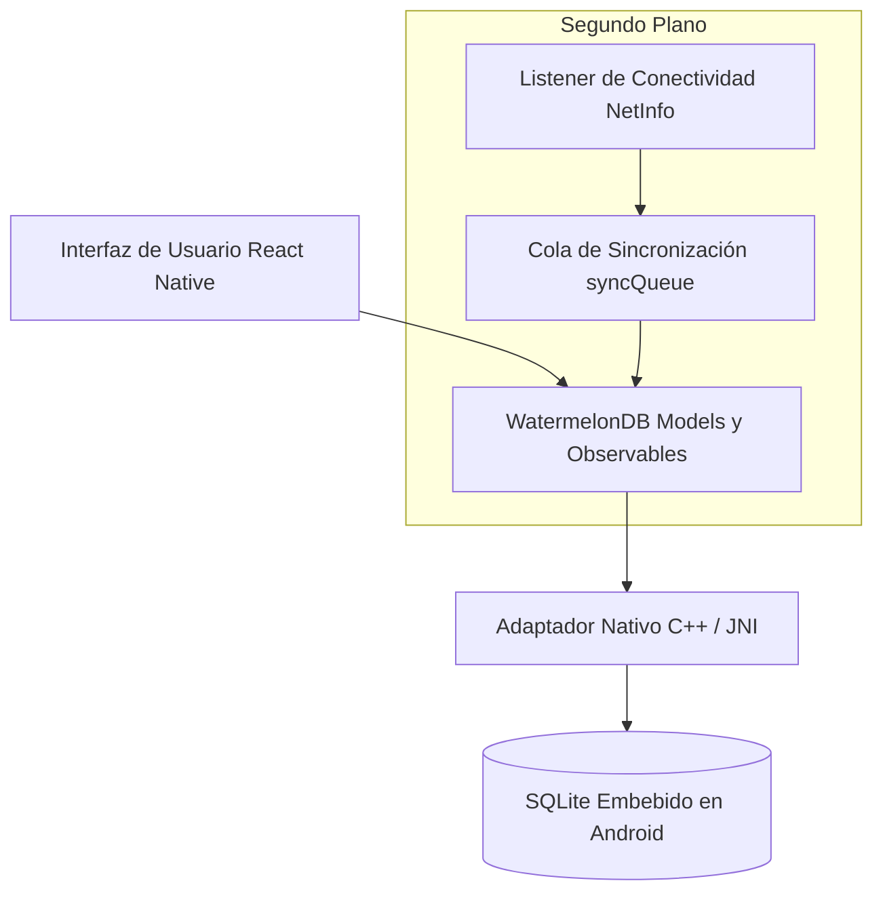

# Base de Datos y Persistencia Offline

En una aplicación agrícola de campo, la persistencia local no es una característica opcional: es el núcleo de la arquitectura. DoctorMaiz fue diseñada bajo la filosofía **Offline-First**, donde el dispositivo móvil es la fuente primaria de verdad y la nube actúa como un canal de respaldo y sincronización secundaria.

---

## El Motor de Datos: WatermelonDB + SQLite

En lugar de utilizar bases de datos clave-valor rudimentarias como `AsyncStorage` (que cargan todo el historial en memoria RAM provocando bloqueos de pantalla), la aplicación utiliza **WatermelonDB**, una biblioteca de datos reactiva de alto rendimiento optimizada para React Native:

### Principales Ventajas en el Campo:
1. **Carga Diferida (*Lazy Loading*):** Si el productor acumula 1,000 escaneos a lo largo del ciclo agrícola, la aplicación no carga las 1,000 fotos en memoria. Solo lee los registros visibles en pantalla según el desplazamiento (*scroll*).
2. **Consultas Reactivas (Observables):** La pantalla de inicio y el mapa de cobertura están suscritos a los cambios de la colección. En cuanto el escaneo se guarda, los marcadores y contadores se actualizan instantáneamente sin necesidad de recargar la vista.
3. **Escrituras Atómicas en Lote:** Todas las transacciones se realizan mediante bloques de escritura atómicos (`database.write(...)`), evitando corrupciones de base de datos si la batería del teléfono se agota en mitad de un guardado.

---

## Esquema de la Tabla de Escaneos (`scans`)

Cada registro de muestreo almacena los siguientes campos estructurados:

| Columna | Tipo SQLite | Propósito |
|---|:---:|---|
| `id` | `TEXT PRIMARY KEY` | Identificador único alfanumérico generado en el cliente |
| `image_uri` | `TEXT` | Ruta local al archivo JPG almacenado en el sandbox seguro |
| `label` | `TEXT` | Clase clasificada (*common_rust*, *gray_leaf_spot*, etc.) |
| `confidence` | `REAL` | Certeza porcentual del modelo (0.00 a 1.00) |
| `distribution` | `TEXT` (JSON) | Probabilidades completas para las 9 clases del catálogo |
| `lat` | `REAL` | Coordenada GPS de latitud registrada en la toma |
| `lon` | `REAL` | Coordenada GPS de longitud registrada en la toma |
| `temperature` | `REAL` | Temperatura climática (°C) en el momento del escaneo |
| `humidity` | `REAL` | Humedad relativa del aire (%) en el momento del escaneo |
| `synced` | `INTEGER` (Boolean) | Bandera `0` (pendiente) o `1` (sincronizado con el servidor) |
| `created_at` | `INTEGER` | Marca de tiempo Unix en milisegundos |

---

## Almacenamiento Seguro con `expo-secure-store`

Los datos sensibles no se guardan en texto plano en la base de datos regular:

- **Tokens de Sesión (JWT):** Las credenciales de acceso de la cuenta del productor se cifran utilizando el enclave seguro del sistema operativo (Android KeyStore).
- **Caché Agroclimática (`doctor_maiz_weather_cache`):** La última lectura meteorológica obtenida por GPS se guarda en almacenamiento seguro para permitir el arranque instantáneo del tablero sin llamadas de red innecesarias.

---

## Cola de Sincronización Resiliente (`syncQueue`)

El módulo de sincronización escucha los cambios de red mediante `@react-native-community/netinfo`:
- Al detectar una conexión estable a internet (Wi-Fi o datos 4G), consulta los registros con `synced = false`.
- Los paquetes se envían en pequeños lotes con reintentos exponenciales (*exponential backoff*).
- Si la conexión se interrumpe súbitamente en medio del campo, la cola retiene la posición exacta sin duplicar muestras ni perder fotos.
