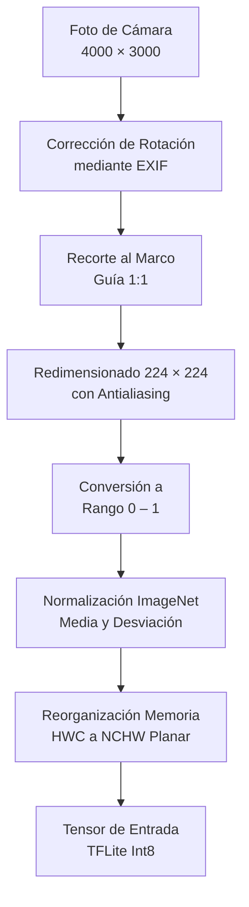

# Pipeline de Inferencia Edge AI en el Dispositivo

Llevar una arquitectura de aprendizaje profundo moderna a un teléfono móvil que opera sin conexión requiere una cuidadosa ingeniería de optimización, empaquetado y procesamiento de tensores.

---

## De PyTorch a TensorFlow Lite Int8

El modelo final seleccionado para producción es **`efficientnet_lite0`**, una variante concebida para prescindir de activaciones complejas (como *swish* o *hard-swish*) y maximizar la compatibilidad con unidades de procesamiento de punto fijo en chips móviles.

| Modelo / Formato | Precisión Numérica | Tamaño en Disco | Latencia Mediana (CPU) | Retención de Macro F1 |
|---|:---:|:---:|:---:|:---:|
| **PyTorch (`best.pth`)** | Float32 | 18.2 MB | ~180 ms (Servidor x86) | 100.0 % (Referencia) |
| **ONNX Runtime** | Float32 | 12.9 MB | ~110 ms (Snapdragon 778G) | 99.9 % |
| **TFLite Cuantizado (Int8)** | **Entero 8-bit** | **3.56 MB** | **~60 ms (MediaTek Dimensity)** | **99.4 %** |

::: tip CUANTIZACIÓN POST-ENTRENAMIENTO (PTQ)
La cuantización reduce en un **72 %** el peso del archivo del modelo y acelera la multiplicación de matrices en la CPU móvil sin pérdida apreciable de capacidad diagnóstica.
:::

---

## Contrato de Preprocesamiento de Píxeles

Un error habitual en aplicaciones de visión artificial móvil es procesar la imagen de manera distinta a como fue entrenada la red neuronal. DoctorMaiz implementa un pipeline estricto de preprocesamiento:

### 1. Corrección EXIF
Los sensores de cámara de Android no rotan los píxeles físicamente al tomar fotos verticales: almacenan una etiqueta numérica de orientación EXIF (`Orientation: 6` para 90° CW). DoctorMaiz recompone los píxeles antes de cualquier cálculo para evitar que la red analice hojas giradas.

### 2. Recorte Central Asistido (*Crop to Overlay*)
La app toma las dimensiones de la pantalla y recorta automáticamente la región encerrada por el marco guía foliar, descartando tierra, cielo y el cuerpo del productor.

### 3. Normalización ImageNet
Los canales RGB escalados entre $[0, 1]$ se normalizan según la ecuación:
$$\text{Canal}_{\text{norm}} = \frac{(\text{Pixel} / 255.0) - \mu_c}{\sigma_c}$$
con constantes de referencia:
$$\mu = [0.485, 0.456, 0.406], \quad \sigma = [0.229, 0.224, 0.225]$$

### 4. Transposición Planar (NCHW)
Los motores gráficos móviles entregan un arreglo entrelazado $[H, W, C]$ (R, G, B, R, G, B...). Para satisfacer la entrada del modelo convolucional, el buffer se reordena en memoria a formato planar $[1, C, H, W]$ en una sola pasada de microsegundos.

---

## Motor C++ con Nitro Modules (`react-native-fast-tflite`)

Para eliminar la penalización de rendimiento del puente JavaScript tradicional de React Native:
- DoctorMaiz utiliza **Nitro Modules**, una tecnología moderna de interoperabilidad directa en C++ (JSI - *JavaScript Interface*).
- La llamada a `predict(tensor)` invoca directamente las bibliotecas nativas de TensorFlow Lite sin serialización JSON intermedia.
- Esto reduce el consumo de memoria y asegura una latencia constante de **~60 milisegundos**.

---

## Salvaguarda Mahalanobis OOD (Out-of-Distribution)

El modelo exporta una salida secundaria con los **embeddings de la capa pre-clasificación** (un vector de 1280 dimensiones). 

El clasificador OOD calcula la distancia mínima de Mahalanobis $D_M$ respecto a las 9 clases conocidas:
$$D_M(x) = \min_{c} \sqrt{(x - \mu_c)^T \Sigma^{-1} (x - \mu_c)}$$

Si $D_M(x)$ es mayor que el umbral de seguridad $\tau = 42.6$, la muestra se cataloga como **"No reconocida"**, protegiendo al productor contra falsos positivos.
