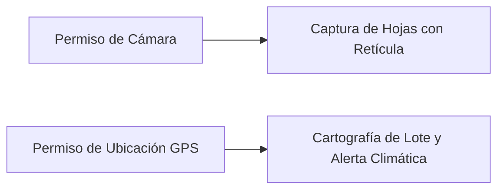

# Instalación y Requisitos

DoctorMaiz fue desarrollada pensando en la heterogeneidad de teléfonos inteligentes utilizados por los agricultores en América Latina. La aplicación está optimizada para ejecutarse con fluidez en dispositivos de gama media y baja.

---

## Requisitos Técnicos del Teléfono

| Componente | Requisito Mínimo | Recomendado para Mejor Experiencia |
|---|---|---|
| **Sistema Operativo** | Android 8.0 (Oreo / API 26) o superior | Android 10.0 (API 29) o superior |
| **Memoria RAM** | 2 GB | 3 GB o más |
| **Almacenamiento Libre** | 120 MB (incluyendo modelo y base de datos) | 500 MB (para almacenar historial amplio de fotos) |
| **Cámara Trasera** | 8 Megapíxeles con autoenfoque (*autofocus*) | 12 Megapíxeles o superior |
| **Sensores** | Módulo GPS integrado | GPS + A-GPS (para geolocalización ágil en lote) |
| **Conectividad** | No requerida para diagnosticar (100 % offline) | Wi-Fi o datos móviles para sincronizar o consultar clima |

::: info COMPATIBILIDAD CON ARQUITECTURAS
El motor nativo de inferencia incluye binarios precompilados de alto rendimiento para **`arm64-v8a`** (la gran mayoría de teléfonos modernos) y **`armeabi-v7a`** (teléfonos de generaciones previas).
:::

---

## Proceso de Instalación Paso a Paso

Al tratarse de una herramienta técnica de investigación y despliegue agronómico directo, la aplicación se distribuye en formato de paquete independiente **APK (`.apk`)**.

<PhoneGallery gap="2rem">
  <PhoneMockup 
    src="/app/pixel4_login.png" 
    caption="Pantalla de Acceso" 
    subtitle="Ingreso con cuenta o modo invitado" 
  />
  <PhoneMockup 
    src="/app/pixel4_register.png" 
    caption="Registro de Productor" 
    subtitle="Asociación de finca y cooperativa" 
  />
</PhoneGallery>

### 1. Descarga del Paquete APK
Descarga la versión más reciente del archivo instalador `DoctorMaiz-v1.0.apk` desde el repositorio oficial o a través del enlace facilitado por tu técnico agrícola o cooperativa.

### 2. Habilitar Fuentes Desconocidas
Si es la primera vez que instalas una aplicación fuera de Google Play Store:
1. Abre el instalador descargado desde la barra de notificaciones o la carpeta *Descargas*.
2. El sistema Android mostrará una advertencia de seguridad: *"Por motivos de seguridad, tu teléfono no tiene permiso para instalar aplicaciones desconocidas de esta fuente"*.
3. Toca en **Configuración** y activa la casilla **Confiar en esta fuente** (o *Permitir desde esta fuente*).
4. Vuelve atrás y presiona **Instalar**.

---

## Configuración de Permisos en el Primer Inicio

Al abrir DoctorMaiz por primera vez, la aplicación solicitará dos permisos indispensables para la labor agronómica:

### 1. Permiso de Cámara (`CAMERA`)
- **Para qué se utiliza:** Para activar el visor en tiempo real y permitir al motor de visión escanear las hojas de maíz en el surco.
- **Opción recomendada:** Selecciona **"Mientras la app esté en uso"**.

### 2. Permiso de Ubicación (`ACCESS_FINE_LOCATION`)
- **Para qué se utiliza:** 
  1. Para etiquetar cada diagnóstico con sus coordenadas de latitud y longitud, permitiendo trazar el **mapa de cobertura del lote**.
  2. Para obtener el pronóstico y las variables agroclimáticas locales (temperatura, humedad, viento y suelo) mediante Open-Meteo.
- **Opción recomendada:** Selecciona **"Permitir mientras la app está en uso"** y activa la opción de **Ubicación Precisa**.

::: warning ¿QUÉ SUCEDE SI RECHAZAS LA UBICACIÓN?
La aplicación continuará diagnosticando enfermedades en la hoja con total normalidad, pero los escaneos no podrán ubicarse en el mapa satelital del lote y el tablero meteorológico mostrará valores agronómicos de referencia en lugar de datos de tu zona.
:::
