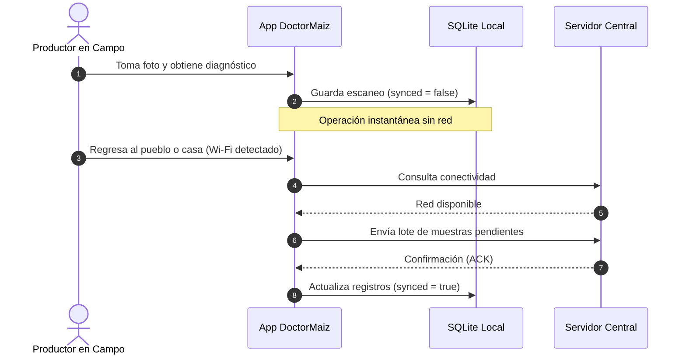

# Primeros Pasos y Gestión de Acceso

DoctorMaiz respeta el principio de **cero fricción en el campo**: un agricultor que necesita evaluar una planta sospechosa no debe verse obligado a llenar formularios ni recordar contraseñas mientras se encuentra en medio de la milpa.

---

## El Modo Invitado (Sin Conexión)

Al iniciar la app, encontrarás el botón **"Continuar como Invitado"**.

<PhoneGallery gap="2rem">
  <PhoneMockup 
    src="/app/pixel4_profile_guest.png" 
    caption="Perfil de Invitado" 
    subtitle="Uso local sin registro" 
  />
  <PhoneMockup 
    src="/app/pixel4_profile.png" 
    caption="Perfil Registrado" 
    subtitle="Impacto colectivo y rangos" 
  />
</PhoneGallery>

### ¿Qué permite el Modo Invitado?
- **Diagnósticos Ilimitados:** Acceso completo al escáner, al modelo de inteligencia artificial y al detector OOD.
- **Historial Local:** Todos los escaneos quedan registrados en la base de datos interna SQLite del teléfono.
- **Mapa de Cobertura:** Visualización de los pines geolocalizados dentro de tu parcela.
- **Monitoreo Agroclimático:** Consulta de variables ambientales con caché local.

::: tip PRIVACIDAD TOTAL EN MODO INVITADO
En el modo invitado, ningún dato, foto ni coordenada sale del teléfono móvil. Si decides crear una cuenta más adelante, todos tus escaneos previos se asociarán automáticamente a tu nuevo usuario sin perder registros.
:::

---

## Crear una Cuenta de Productor

Registrarse toma menos de dos minutos y ofrece ventajas fundamentales para el manejo técnico de la finca:

1. **Respaldo en la Nube:** Si cambias de teléfono o se daña el equipo, no pierdes el historial de tus cultivos ni los diagnósticos pasados.
2. **Contribución al Dataset Nacional:** Posibilidad de postular tus fotografías para enriquecer el modelo de IA regional.
3. **Métricas de Impacto Colectivo:** Sistema de rangos y reconocimientos según el número de hectáreas monitoreadas y muestras aportadas.

### Datos Requeridos en el Registro
- **Nombre Completo:** Para personalizar reportes agronómicos.
- **Correo Electrónico:** Sirve como identificador y canal de recuperación de clave.
- **Contraseña Segura:** Mínimo 8 caracteres.
- **Ubicación o Cooperativa (Opcional):** Permite agrupar análisis por región agrícola (Occidente, Centro u Oriente).

---

## Sincronización y Cola de Datos Offline

En el campo, la cobertura celular suele ser nula o inestable. DoctorMaiz implementa una arquitectura **Offline-First con Cola de Sincronización Transparente**:

### Cómo Forzar la Sincronización Manual
Aunque la aplicación detecta la red automáticamente al recuperar señal, puedes forzar una sincronización en cualquier momento:
1. Dirígete a la pestaña **Perfil**.
2. En la sección *Estado de Datos*, verifica el contador de **"Muestras pendientes de subir"**.
3. Presiona el botón verde **"Sincronizar Ahora"**.
4. Una barra de progreso confirmará la subida de cada registro fotográfico.
