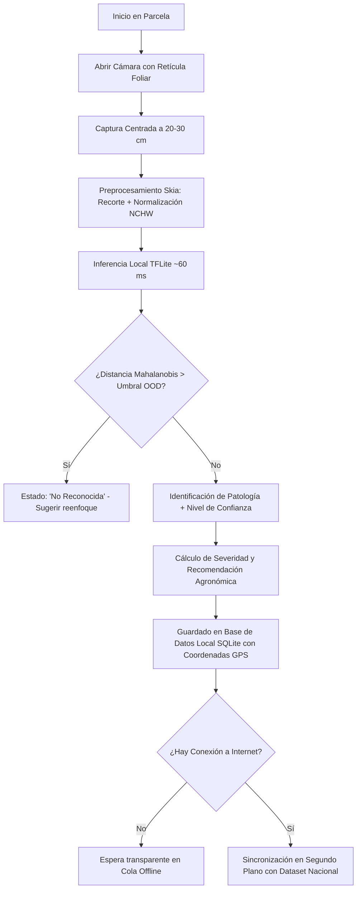

# DoctorMaiz · Aplicación Móvil de Campo

**DoctorMaiz** es la aplicación móvil complementaria del proyecto de investigación, diseñada específicamente para agricultores, agrónomos y técnicos de extensión rural. Su objetivo primordial es brindar **diagnóstico fitopatológico inmediato en el surco**, funcionando de forma **100 % autónoma sin necesidad de conexión celular ni acceso a internet**.

---

<PhoneGallery gap="2rem">
  <PhoneMockup 
    src="/app/pixel4_home_top.png" 
    caption="Dashboard Agroclimático" 
    subtitle="Monitoreo GPS y acceso rápido" 
  />
  <PhoneMockup 
    src="/app/pixel4_camera.png" 
    caption="Escáner Asistido" 
    subtitle="Retícula foliar inteligente" 
  />
  <PhoneMockup 
    src="/app/pixel4_detail_scan.png" 
    caption="Diagnóstico Inmediato" 
    subtitle="Certeza y severidad en <60 ms" 
  />
</PhoneGallery>

---

## Capacidades Principales

::: tip 100 % OFFLINE-FIRST
A diferencia de las soluciones basadas en servidores en la nube, el modelo de visión artificial corre íntegramente en la CPU del teléfono móvil mediante **TensorFlow Lite cuantizado a 8 bits (Int8)**. El productor puede diagnosticar en valles remotos o zonas montañosas sin cobertura telefónica.
:::

| Característica | Especificación en DoctorMaiz | Beneficio en Campo |
|---|:---:|---|
| **Velocidad de Inferencia** | **~60 ms** (en procesador móvil) | Diagnóstico instantáneo sin esperas ni pausas |
| **Tamaño del Modelo** | **3.56 MB** (`efficientnet_lite0_int8`) | No satura el almacenamiento del dispositivo |
| **Salvaguarda Fuera de Dominio** | **Distancia de Mahalanobis** (OOD) | Rechaza fotos desenfocadas, malezas u objetos extraños |
| **Monitoreo Agroclimático** | **4 Variables** con caché persistente | Alertas tempranas de roya y deriva de pulverización |
| **Mapeo Satelital** | **GPS automático por toma** | Cartografía de calor con focos infecciosos en el lote |
| **Persistencia Local** | **WatermelonDB + SQLite** | Historial completo de muestreos accesible sin red |

---

## Flujo Operativo en Campo

El siguiente diagrama ilustra el ciclo de vida completo de una muestra, desde la captura visual en la milpa hasta la eventual sincronización con el Dataset Nacional:

---

## Estructura de la Documentación

La documentación está organizada en secciones especializadas para guiar tanto al usuario final en el campo como a los investigadores de software y agronomía:

1. [**Guía de Inicio**](/es/app/guia-inicio/instalacion): Requisitos mínimos de hardware, instalación del instalador `.apk`, permisos de cámara y ubicación, y modos de autenticación (Invitado vs. Registrado).
2. [**Operaciones en Campo**](/es/app/operaciones-campo/escaneo-guiado): Técnicas de encuadre en el surco, interpretación del acordeón de severidad, uso del tablero agroclimático y cartografía satelital de lotes.
3. [**Catálogo de Sanidad Vegetal**](/es/app/catalogo-enfermedades/): Atlas ilustrado con las 9 patologías y deficiencias reconocidas, síntomas clave y planes de manejo integrado.
4. [**Arquitectura Técnica**](/es/app/arquitectura-tecnica/pipeline-inferencia): Detalles de ingeniería móvil (React Native, Expo, bindings C++ Nitro Modules, cuantización Int8 y WatermelonDB).
5. [**Preguntas Frecuentes y Soporte**](/es/app/faq): Resolución de problemas habituales, condiciones de luz adversas y calibración.
