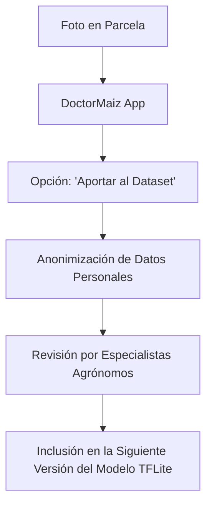

# Aporte a la Ciencia: Dataset Nacional de Maíz

El entrenamiento de algoritmos de inteligencia artificial depende de la diversidad geográfica de sus fotografías. Sin embargo, en la investigación inicial de DoctorMaiz se evidenció una realidad contundente: **de los 14 datasets públicos internacionales evaluados, ninguno incluía imágenes capturadas en Centroamérica**.

DoctorMaiz convierte a cada agricultor en un colaborador activo de la ciencia mediante su módulo de **Contribución Ciudadana**.

---

<PhoneGallery gap="2rem">
  <PhoneMockup 
    src="/app/pixel4_contribute.png" 
    caption="Módulo de Contribución" 
    subtitle="Selección y envío de fotografías" 
  />
  <PhoneMockup 
    src="/app/contribuir.png" 
    caption="Validación Comunitaria" 
    subtitle="Aporte a la investigación regional" 
  />
</PhoneGallery>

---

## Por qué los Modelos Globales Fallan en Nuestra Región

Los modelos entrenados con imágenes de otros continentes sufren una pérdida de precisión cuando se aplican en parcelas locales debido a factores ecológicos particulares:

1. **Variedades y Genética Criolla:** Las variedades locales (como híbridos *CENTA H-59*, *Pasaquina* o maíces criollos de montaña) presentan una textura foliar, vellosidad y coloración distinta a las variedades de Norteamérica.
2. **Suelos Volcánicos y Deficiencias Complejas:** Los andosoles y vertisoles salvadoreños presentan dinámicas de fijación de fósforo muy marcadas, provocando manchas rojizas que modelos extranjeros confunden fácilmente con virosis.
3. **Complejo Mancha de Asfalto (*Phyllachora maydis*):** Es una patología devastadora típica del trópico americano que apenas existe en los datasets de laboratorio de Estados Unidos o Europa.

---

## Cómo Funciona el Envío de Muestras

El agricultor puede postular fotografías de sus escaneos para que formen parte del **Dataset Abierto Nacional**:

### Protocolo de Privacidad y Anonimización
- **Sin Datos Personales:** La fotografía se desvincula de tu nombre, teléfono y correo electrónico.
- **Geomasking de Seguridad:** La coordenada GPS exacta se aproxima a nivel de cantón o municipio para proteger la ubicación precisa de la propiedad del agricultor.
- **Acceso Abierto a la Academia:** Las muestras validadas se ponen a disposición de universidades, escuelas de agronomía e instituciones de investigación agrícola sin fines de lucro.
