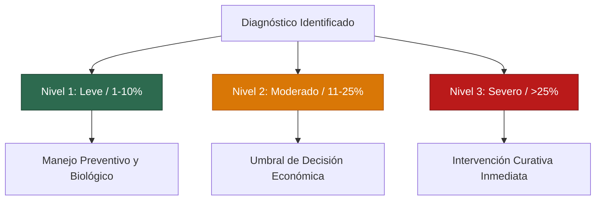

# Diagnóstico e Interpretación de Severidad

Una vez que el motor TFLite procesa la fotografía, la pantalla de resultados entrega información agronómica estructurada para orientar la toma de decisiones técnicas.

---

## Anatomía de la Pantalla de Resultados

<PhoneGallery gap="2rem">
  <PhoneMockup 
    src="/app/pixel4_detail_scan.png" 
    caption="Resultado Principal" 
    subtitle="Confianza, condición y clima asociado" 
  />
  <PhoneMockup 
    src="/app/pixel4_detail_accordion.png" 
    caption="Acordeón de Severidad" 
    subtitle="Recomendaciones por umbral de daño" 
  />
</PhoneGallery>

### 1. Indicador Principal y Nivel de Confianza
- **Nombre de la Patología:** Etiqueta diagnóstica clasificada (ej. *Roya Común*, *Mancha Gris*, *Deficiencia de Nitrógeno*).
- **Gráfico Donut de Confianza:** Porcentaje de certeza matemática del modelo convolucional (por ejemplo, 88 %).
- **Hipótesis Secundaria:** Si el modelo detecta incertidumbre entre dos enfermedades de síntomas parecidos, la aplicación incluye una advertencia explícita:
  > *"Podría tratarse también de: Tizón Foliar (12 %)"*  
  Esto alerta al agrónomo para que inspeccione hojas vecinas antes de prescribir un fungicida específico.

### 2. Variables Meteorológicas del Momento
Justo debajo del diagnóstico, la app vincula la **temperatura (°C)** y la **humedad relativa (%)** registradas al momento del escaneo, permitiendo correlacionar el ataque con el clima reinante.

---

## ¿Por qué una Guía de Severidad y no un Porcentaje Automático?

Es tentador exigir que la inteligencia artificial entregue un número como *"Severidad: 18.4 %"*. Sin embargo, en fitopatología agrícola real, esa cifra suele ser un engaño:

::: warning LA REALIDAD DEL DOSEL VEGETAL
Una fotografía de celular captura apenas un área de **10 × 10 cm** de una sola hoja. Un maíz desarrollado tiene más de **14 hojas activas** y alcanza más de dos metros de altura. Un porcentaje matemático calculado sobre una foto aislada no representa el estado de salud de la planta ni del lote.
:::

Por rigor agronómico, DoctorMaiz combina la **clasificación asistida por visión** con un **acordeón técnico de tres niveles de severidad** basado en escalas científicas homologadas (CIMMYT y CIAT).

---

## Los 3 Niveles del Acordeón Agronómico

El productor o técnico compara visualmente el estado general de su cultivo con los tres escenarios del acordeón:

### Nivel 1: Leve (1 % – 10 % de área afectada)
- **Síntomas en planta:** Lesiones escasas, dispersas principalmente en las hojas del tercio inferior (hojas basales). La hoja de la mazorca se encuentra limpia.
- **Acción recomendada:** No requiere agroquímicos costosos. Aplicación preventiva de biofungicidas (*Bacillus subtilis*), caldo sulfocálcico o fertilización foliar con silicio para engrosar la cutícula.

### Nivel 2: Moderado (11 % – 25 % de área afectada)
- **Síntomas en planta:** Lesiones en el tercio medio. Las manchas comienzan a rodear o aproximarse a la hoja de la mazorca (hoja índice).
- **Acción recomendada:** **Punto crítico de intervención.** Si el maíz está entre floración (VT) y llenado de grano (R2), se justifica el control químico focalizado (triazoles o estrobirulinas) para proteger el rendimiento de la mazorca.

### Nivel 3: Severo (Mayor al 25 % de área afectada)
- **Síntomas en planta:** Gran parte del follaje necrosado o seco. Ataque masivo en la hoja de la mazorca y tercio superior.
- **Acción recomendada:** Intervención curativa urgente para evitar acame (vuelco de la planta por debilitamiento del tallo) y reducir la carga de inóculo para la siguiente siembra.

---

## Protocolo de Muestreo en el Lote (Patrón en "W")

Para tomar una decisión que involucre compras o aplicaciones a gran escala, **nunca tomes una sola muestra**:

1. Ingresa a la parcela descartando las primeras dos hileras del borde (*efecto orilla*).
2. Recorre el lote siguiendo una trayectoria en forma de **"W"** o **"X"**.
3. Realiza de **15 a 20 escaneos** distribuidos a lo largo del recorrido.
4. Consulta el **Mapa de Cobertura** en DoctorMaiz: si más del 30 % de los puntos muestran severidad moderada o alta, procede con la aplicación generalizada.
