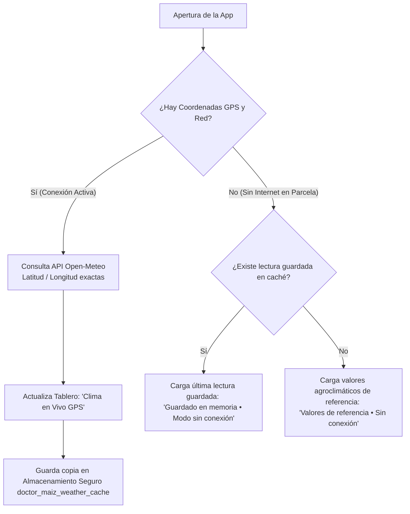

# Monitoreo Agroclimático y Alertas de Campo

Las enfermedades foliares en el cultivo de maíz no aparecen de forma espontánea: son el resultado de la interacción entre el hospedero (la planta de maíz), el patógeno (las esporas del hongo) y el **ambiente meteorológico** (el triángulo de la enfermedad). 

DoctorMaiz integra un tablero de 4 variables meteorológicas directamente en la pantalla de inicio, traduciendo los datos físicos en **criterios prácticos de manejo agronómico**.

---

<PhoneGallery gap="2rem">
  <PhoneMockup 
    src="/app/pixel4_home_top.png" 
    caption="Tablero Agroclimático" 
    subtitle="4 variables con estado de conexión" 
  />
  <PhoneMockup 
    src="/app/home.png" 
    caption="Pantalla de Inicio" 
    subtitle="Acceso directo al escáner y mapa" 
  />
</PhoneGallery>

---

## Las 4 Variables Evaluadas

Al tocar cualquiera de las 4 tarjetas o el distintivo inferior en la pantalla principal, se despliega el **Modal de Criterio Agroclimático**, con la interpretación agronómica detallada de la variable seleccionada:

### 1. Temperatura Ambiental (°C)
- **Rango de Alerta Máxima:** **20 °C a 28 °C**
- **Impacto Agronómico:** Es la ventana térmica óptima para la germinación y multiplicación de esporas de **Roya Común (*Puccinia sorghi*)** y **Tizón Foliar (*Bipolaris maydis*)**. 
- **Recomendación en Lote:** Si la temperatura de tu zona se mantiene en este rango durante varios días con noches frescas, inspecciona con lupa el envés de las hojas basales e intermedias antes de que aparezcan pústulas generalizadas.

### 2. Humedad Relativa del Aire (%)
- **Umbral de Alerta:** **Superior al 80 %**
- **Impacto Agronómico:** Las esporas fúngicas requieren una película microscópica de agua libre sobre la lámina foliar durante al menos 6 a 8 horas continuas para emitir el tubo germinativo y penetrar los estomas.
- **Recomendación en Lote:** Si la humedad relativa supera el 80 %, abstente de realizar podas o labores que causen heridas mecánicas en el follaje, ya que facilitan la entrada de bacterias como *Pantoea stewartii*.

### 3. Humedad Volumétrica del Suelo
DoctorMaiz clasifica la humedad del perfil superficial (0 a 7 cm) en cuatro estados agronómicos:

| Estado | Rango Volumétrico | Diagnóstico en el Lote |
|---|:---:|---|
| **Seca** | $< 0.15\ \text{m}^3/\text{m}^3$ | Estrés hídrico: hojas acartuchadas hacia arriba. Mayor susceptibilidad a trips y cogollero. |
| **Adecuada** | $0.15 - 0.38\ \text{m}^3/\text{m}^3$ | Capacidad de campo ideal: transpiración y absorción de nutrientes óptimas. |
| **Exceso** | $0.38 - 0.45\ \text{m}^3/\text{m}^3$ | Suelo pesado: riesgo de lixiviación de nitratos hacia capas profundas. |
| **Saturado** | $> 0.45\ \text{m}^3/\text{m}^3$ | Encharcamiento: asfixia radicular (*hipoxia*). No apliques fertilizante edáfico granulado. |

### 4. Velocidad del Viento (km/h)
- **Umbral de Seguridad:** **Menor a 15 km/h**
- **Impacto Agronómico:** Aplicar agroquímicos o biológicos con vientos fuertes provoca **deriva de gota**, es decir, el viento arrastra el producto hacia parcelas vecinas o malezas, desperdiciando dinero y provocando contaminación involuntaria.
- **Recomendación en Lote:** Si el viento supera los 15 km/h, pospón la pulverización con bomba de mochila para primeras horas de la mañana (5:30 am – 7:30 am), cuando el aire suele estar en calma.

---

## Arquitectura Offline-First de Clima

¿Cómo obtiene la aplicación estos datos si el agricultor no tiene internet en la milpa?

1. **Consulta Georreferenciada con Open-Meteo:** Cuando el teléfono cuenta con red, consulta la API meteorológica de precisión mediante coordenadas GPS exactas (sin API keys pagas ni cuotas restrictivas).
2. **Caché Criptográfica Persistente:** La respuesta se almacena de inmediato en el almacenamiento seguro del sistema (`expo-secure-store`).
3. **Resiliencia Total en Campo:** Al entrar en zonas sin cobertura, la app continúa mostrando la última condición registrada indicándolo con un distintivo color ámbar: *Guardado en memoria (Modo sin conexión)*.
