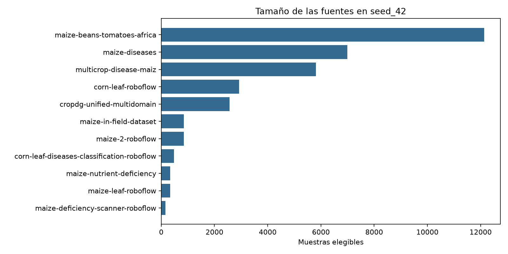
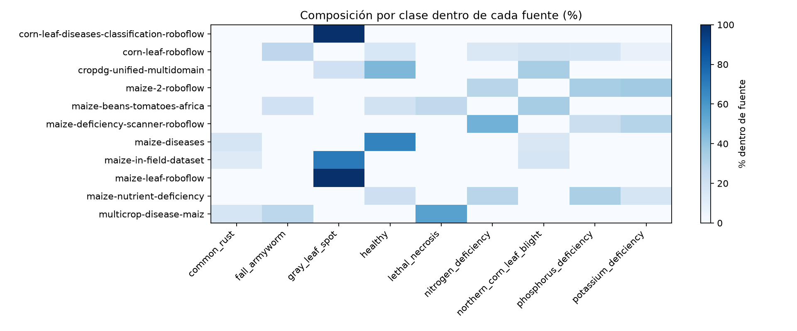
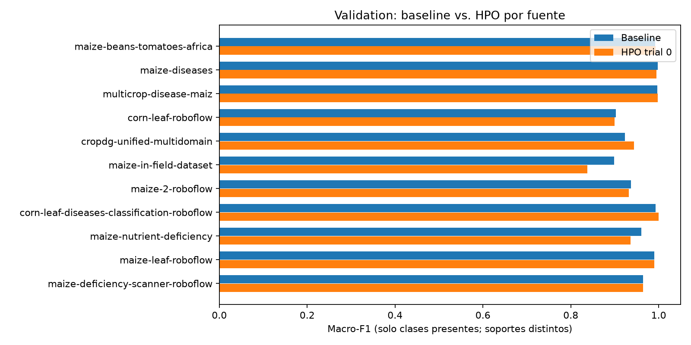
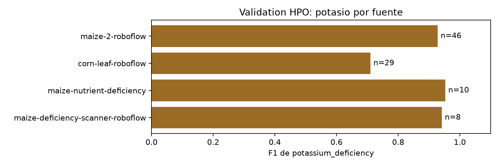

# Distribución y rendimiento por fuente — `seed_42`

Fecha: 29 de septiembre de 2026. Fase descriptiva, sin entrenamiento ni cambios en
`seed_42`. Corpus: `corn-clean:/clean`; particiones congeladas:
`corn-outputs:/splits/seed_42`. Se analizaron 33 429 muestras elegibles
(23 400 train, 5 014 validation y 5 015 test). Los SHA-256 del master, lock y
tres CSV coinciden con el lock; se detallan en
[`source_analysis_summary.json`](source_analysis_summary.json). Las ocho exclusiones
contractuales no se reincorporaron.

## Procedencia y cobertura

El `source_id` procede del master manifest, no de la posición de las filas ni de
una clasificación visual nueva. Las cuatro tablas de predicciones se unieron
exclusivamente por `sample_id`; se rechazaron identidades duplicadas, ausentes o
etiquetas contradictorias. Los CSV completos de [fuentes](source_distribution.csv)
y [fuente × clase](source_class_distribution.csv) incluyen porcentajes de cada
split, porcentajes dentro de la fuente y fracción de cada clase aportada por ella.

| Fuente | Total | Train | Val | Test | Clases |
|---|---:|---:|---:|---:|---:|
| maize-beans-tomatoes-africa | 12 136 | 8 487 | 1 837 | 1 812 | 4 |
| maize-diseases | 6 989 | 4 881 | 1 047 | 1 061 | 3 |
| multicrop-disease-maiz | 5 816 | 4 072 | 864 | 880 | 3 |
| corn-leaf-roboflow | 2 919 | 2 081 | 400 | 438 | 6 |
| cropdg-unified-multidomain | 2 562 | 1 776 | 410 | 376 | 3 |
| maize-in-field-dataset | 852 | 593 | 123 | 136 | 3 |
| maize-2-roboflow | 846 | 593 | 126 | 127 | 3 |
| corn-leaf-diseases-classification-roboflow | 480 | 342 | 71 | 67 | 1 |
| maize-nutrient-deficiency | 340 | 241 | 58 | 41 | 4 |
| maize-leaf-roboflow | 331 | 227 | 52 | 52 | 1 |
| maize-deficiency-scanner-roboflow | 158 | 107 | 26 | 25 | 3 |

Dos fuentes contienen solo `gray_leaf_spot`: `corn-leaf-diseases-classification-roboflow`
y `maize-leaf-roboflow`. En las 99 celdas fuente × clase, 65 están vacías.
`maize-diseases` es 67.8 % `healthy`; aporta 54.2 % de todas las imágenes
`healthy` y 52.8 % de `common_rust`. `multicrop-disease-maiz` es 55.6 %
`lethal_necrosis` y aporta 50.4 % de esa clase. `maize-2-roboflow` aporta
49.6 % de `potassium_deficiency`; `corn-leaf-roboflow` aporta 50.1 % de
`nitrogen_deficiency` y 53.2 % de `phosphorus_deficiency`. La estratificación
del split no puede crear combinaciones fuente-clase ausentes del corpus.

La tabla de contingencia de 11 fuentes × 9 clases tiene `n=33 429` y un V de
Cramér de **0.5030** (`chi²=67 673.21`, sin corrección). V está acotado entre
0 y 1 y resume asociación, no causalidad ni capacidad del modelo para reconocer
la procedencia. La entropía de etiquetas por fuente está en el JSON; es cero
en las dos fuentes de una sola clase. El tamaño de muestra hace poco útil
interpretar aquí un valor p sin una pregunta inferencial preespecificada.

## Predicciones y definición de las métricas

Baseline: run `20260921_204608`, checkpoint SHA-256
`860180f33bf1749ffee9f3cccb9569a47afd9ca0fcef52713e18f99f82a57859`.
HPO: estudio `efficientnet_lite0_seed42_hpo_v1`, trial 0, checkpoint SHA-256
`ae39a1c4a8b757021ec2c34a856d6fb484bf801a6adc3bfb71860d58e9d81471`.
El HPO reutiliza sus predicciones congeladas de validation y test. El baseline
reutiliza las de test archivadas. Como no se encontró un CSV por muestra de su
validation, se ejecutó **solo inferencia local de validation** con el checkpoint
contractual, sin entrenamiento ni acceso a test. Las 5 014 predicciones
reprodujeron exactamente el Macro-F1 registrado: `0.9560862657056215`.
Su [recibo](baseline_validation_inference.json) y
[CSV](baseline_validation_predictions.csv) quedan versionables aquí.

El Macro-F1, precision macro y recall macro de cada fuente promedian **solo las
clases presentes en su ground truth**; una clase ausente no se introduce como
un cero artificial. Los falsos positivos hacia una clase presente sí reducen
su precision. `classes_present` y `samples` acompañan cada fila. Weighted-F1
usa los mismos soportes. ECE tiene 15 bins uniformes y solo se muestra para
`n≥30`; incluso entonces es exploratorio. `pred_prob` es la confianza de la
clase predicha, no el vector completo de probabilidades. Las métricas por clase
están en [class_metrics_by_source.csv](class_metrics_by_source.csv) y las
[confusiones](confusion_by_source.csv) incluyen conteo y normalización por
clase real para las fuentes principales.

## Validation: comparación principal

| Fuente | n | Clases | Macro-F1 baseline | Macro-F1 HPO | Δ HPO−baseline |
|---|---:|---:|---:|---:|---:|
| maize-beans-tomatoes-africa | 1 837 | 4 | 0.9922 | 0.9926 | +0.0004 |
| maize-diseases | 1 047 | 3 | 0.9979 | 0.9952 | −0.0027 |
| multicrop-disease-maiz | 864 | 3 | 0.9972 | 0.9976 | +0.0004 |
| corn-leaf-roboflow | 400 | 6 | 0.9024 | 0.8993 | −0.0032 |
| cropdg-unified-multidomain | 410 | 3 | 0.9234 | 0.9434 | +0.0199 |
| maize-in-field-dataset | 123 | 3 | 0.8982 | 0.8374 | −0.0608 |
| maize-2-roboflow | 126 | 3 | 0.9365 | 0.9319 | −0.0046 |
| corn-leaf-diseases-classification-roboflow | 71 | 1 | 0.9929 | 1.0000 | +0.0071 |
| maize-nutrient-deficiency | 58 | 4 | 0.9610 | 0.9357 | −0.0253 |
| maize-leaf-roboflow | 52 | 1 | 0.9903 | 0.9903 | 0 |
| maize-deficiency-scanner-roboflow | 26 | 3 | 0.9645 | 0.9645 | 0 |

HPO mejora cuatro fuentes, empata dos y empeora cinco en validation. Las
diferencias de fuentes pequeñas son inestables y no hay intervalos de confianza
ni replicación entre semillas. `corn-leaf-roboflow` concentra 32 errores HPO
en 400 imágenes (8.0 %); `cropdg-unified-multidomain` 17/410 (4.1 %) y
`maize-in-field-dataset` 16/123 (13.0 %). El ranking no equipara fuentes con
una, tres y seis clases: la métrica tiene distinto conjunto evaluable. Todos
los valores, incluidos accuracy, weighted-F1, precision, recall, confianza y
ECE, están en [validation_metrics_by_source.csv](validation_metrics_by_source.csv).

## Test: análisis descriptivo post-hoc

El test ya había sido evaluado; aquí solo se reagrupan las predicciones.
**No se usó este desglose para elegir modelo o hiperparámetros.** Las cifras
completas están en [test_metrics_by_source.csv](test_metrics_by_source.csv).

| Fuente | n | Macro-F1 baseline | Macro-F1 HPO | Errores HPO |
|---|---:|---:|---:|---:|
| maize-beans-tomatoes-africa | 1 812 | 0.9948 | 0.9905 | 18 |
| maize-diseases | 1 061 | 0.9984 | 0.9984 | 3 |
| multicrop-disease-maiz | 880 | 0.9958 | 0.9961 | 6 |
| corn-leaf-roboflow | 438 | 0.9146 | 0.9001 | 34 |
| cropdg-unified-multidomain | 376 | 0.9399 | 0.9381 | 18 |
| maize-in-field-dataset | 136 | 0.7994 | 0.7851 | 24 |
| maize-2-roboflow | 127 | 0.8649 | 0.8756 | 16 |
| corn-leaf-diseases-classification-roboflow | 67 | 1.0000 | 1.0000 | 0 |
| maize-nutrient-deficiency | 41 | 0.9535 | 0.9535 | 2 |
| maize-leaf-roboflow | 52 | 1.0000 | 1.0000 | 0 |
| maize-deficiency-scanner-roboflow | 25 | 0.8383 | 0.8720 | 3 |

`maize-diseases` aporta 20.9 % del corpus y tres clases: `common_rust`
1 192, `healthy` 4 741, `northern_corn_leaf_blight` 1 056. Sus tamaños son
4 881/1 047/1 061. HPO tiene 4 errores en validation y 3 en test; baseline
1 y 3. En test, ambos equivocan un `healthy` como `fall_armyworm`, otro
como `lethal_necrosis` y un `northern_corn_leaf_blight` como
`gray_leaf_spot`. La confianza media de test es 0.832 baseline frente a 0.930
HPO; ECE 0.165 frente a 0.069.

`multicrop-disease-maiz` aporta 17.4 % del corpus y tres clases:
`common_rust` 958, `fall_armyworm` 1 627 y `lethal_necrosis` 3 231.
Sus tamaños son 4 072/864/880. HPO tiene 5 errores en validation y 6 en
test; baseline 6 y 6. En test, la confusión HPO principal es
`lethal_necrosis → healthy` (3). Confianza media: 0.852 baseline frente a
0.923 HPO; ECE 0.142 frente a 0.071. Las dos fuentes prioritarias **no**
concentran los errores del split vigente, aunque sí una parte importante de
ciertas etiquetas. Mejor rendimiento aquí no descarta un problema al cambiar
de dominio.

## Deficiencias N/P/K

Las cuatro fuentes con N/P/K y todos sus soportes, precision, recall, F1,
errores, confusión principal y confianza de aciertos/errores aparecen en
[nutrition_metrics_by_source.csv](nutrition_metrics_by_source.csv). Potasio
no depende de una sola fuente: 308 imágenes de `maize-2-roboflow`, 210 de
`corn-leaf-roboflow`, 56 de `maize-nutrient-deficiency` y 47 de
`maize-deficiency-scanner-roboflow`.

En validation HPO, potasio tiene F1 **0.710** con 29 muestras de
`corn-leaf-roboflow`, frente a **0.928** con 46 de `maize-2-roboflow`;
las otras dos fuentes tienen solo 10 y 8 muestras. En test post-hoc, los F1
son 0.706 (n=30), 0.854 (n=47), 0.909 (n=6) y 0.842 (n=10), respectivamente.
La debilidad observada se concentra en `corn-leaf-roboflow`, pero los soportes
son modestos y no permiten atribuir causa. Allí las principales confusiones
de potasio son con nitrógeno. El patrón de fósforo y nitrógeno también varía
entre fuentes y se conserva en el CSV para evitar reducirlo a un único promedio.

## Peso de fuentes, shift y atajos posibles

El Macro-F1 global contractual de validation es 0.95609 baseline y 0.95729
HPO; el test global es 0.94800 y 0.94313. Como exploración de peso por fuente,
la media **no ponderada** de los 11 Macro-F1 por fuente es 0.95970 y 0.95344
en validation; 0.93634 y 0.93723 en test post-hoc. Esta media no sustituye
la métrica contractual y es sensible a dos fuentes de una sola clase. El
comportamiento global ponderado por muestras está influido por las tres
fuentes mayores (74.6 % del corpus); un promedio simple por fuente plantea
otra pregunta. No se infiere significancia de diferencias pequeñas.

**Hechos:** el rendimiento y la calibración varían por fuente; 65/99 pares
fuente-clase están ausentes; hay formatos y tamaños de imagen distintivos.
Por ejemplo, `corn-leaf-roboflow` usa 640×640 en todas sus 2 919 imágenes,
`cropdg-unified-multidomain` 256×256 en sus 2 562, y
`maize-leaf-roboflow` 3024×3024 en 329/331. El inventario de dimensiones
está en [source_image_metadata.csv](source_image_metadata.csv) y los formatos
en [source_file_extensions.csv](source_file_extensions.csv).

**Interpretación limitada:** estos contrastes son compatibles con domain
shift y hacen plausible un atajo `source → label`; no prueban que el modelo
reconozca fondos, marcas de agua, iluminación o tamaño original para predecir.
La entrada del modelo se redimensiona a 224×224 y no se realizó inspección
visual masiva ni intervención causal. No se eliminó ninguna fuente.

## ¿Justifica diseñar LOSO?

Sí, como pregunta siguiente sobre generalización fuera de fuente, **no** como
resultado de esta fase. La [tabla de factibilidad](loso_feasibility.csv)
calcula el holdout aproximado y train restante si se retira cada fuente del
train vigente. En los 11 casos permanecen las nueve clases en el train restante;
esto no garantiza soporte suficiente ni comparabilidad de prevalencias.

| Candidato | Holdout aprox. | Train restante | Clases en holdout | Clases sin train |
|---|---:|---:|---|---:|
| maize-diseases | 6 989 | 18 519 | common_rust; healthy; northern_corn_leaf_blight | 0 |
| multicrop-disease-maiz | 5 816 | 19 328 | common_rust; fall_armyworm; lethal_necrosis | 0 |
| corn-leaf-roboflow | 2 919 | 21 319 | seis clases, incluidas N/P/K | 0 |
| maize-in-field-dataset | 852 | 22 807 | common_rust; gray_leaf_spot; northern_corn_leaf_blight | 0 |

Un diseño futuro debe congelar de antemano modelo, semillas, presupuesto,
preprocesamiento, fuente holdout y métrica con clases evaluables; separar
selection de evaluation y comparar solo etiquetas compartidas, reportando
soporte y prevalencia. Los altos resultados in-source de `maize-diseases` y
`multicrop-disease-maiz` no predicen su rendimiento al quedar fuera del train.
No se ejecutó LOSO, multi-seed, CV, HPO, ensamble ni entrenamiento formal.

## Reproducción

Los scripts son `scripts/experiments/infer_baseline_validation.py` (única
inferencia nueva), `source_analysis.py`, `source_metadata.py` y
`plot_source_analysis.py`. El primer comando requiere `DATASET_ROOT` apuntando
a una copia íntegra de `corn-clean:/clean`; los demás solo leen CSV. La copia
temporal actual en `/tmp/doctormaiz_pixel_audit_20260929/` es material de
trabajo, no la fuente canónica. Las rutas y hashes de predicciones se registran
en el JSON; no se reescribieron los archivos de origen. El test se usó
exclusivamente para este análisis descriptivo post-hoc.
